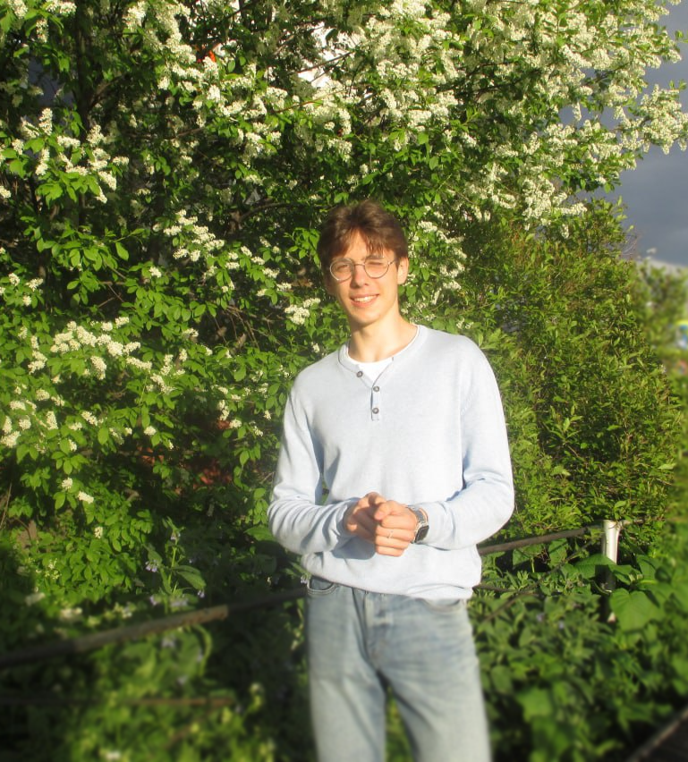

# CV
1. My name is __Fyodor Raevskiy__  
   

2. Contacts:
   - Telegram: @FyodoRaev
   - Discord:  FyodoRaev#2654

3. About me:
   - Mathematics enthusiast, who finds it the most beatiful creation of man. I'm fascinated with mathfilled areas of programming
   - I think Machine Learning is perhaps one of the greatest human investions so I want to be in the cutting edge of the field
   - I am glad to have a lively conversation and communication with people and therefore I can fit into a team very easily

4. My skills:
   - Python, sklearn, NumPy and ~Catboost. I have completed Tinkoff Generation Machine Learning programm so I am familiar with such tools.
   - Rust (currently doing project with OpenGL on Rust)
   - C++ ( in the context of competetive programming)
  
5. Projects:
   - Neural Network for MNIST dataset https://github.com/FyodoRaev/MNIST-neural-network
   - Fifa exploratory Data Analysis (in Russian)https://github.com/FyodoRaev/Sample-ML-Repo/blob/hw02/02.%20Data%20Wrangling/fifaeda/fifaeda.ipynb 
   - Diabetes dataset EDA(in Russian) https://github.com/FyodoRaev/Sample-ML-Repo/blob/hw04/06.%20Overfittng%20problem/Tinkoff_Generation_3_linear_regression_inclass.ipynb 
   - Rust Glium Metaballs project https://github.com/FyodoRaev/GliumMetaballs
  
  

6. My education:
   - Saint Petersburg Presidential Physics and Mathematics Lyceum No. 239 (High school)
   - Tinkoff Generation Machine Learning programm 
   - Tinkoff Generation Olympiad Mathematics programm
7. Language skills:
   - English level B2
   - Russian native 
